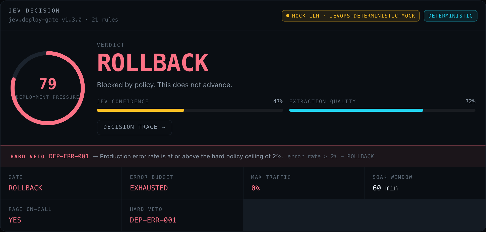
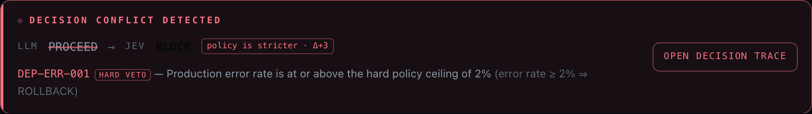
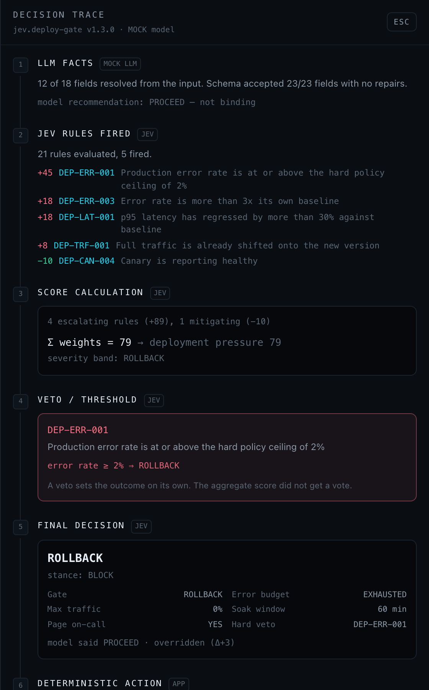

# JevOps

[](https://github.com/nishant-ranjan28/jevops/actions/workflows/ci.yml)
[](LICENSE)
[](.nvmrc)

**An AI-powered engineering decision cockpit.**

An LLM reads the mess. A deterministic policy engine called **Jev** makes the call. The
application executes it. The LLM only gets the last word on the *explanation* — never on
the outcome.

https://github.com/user-attachments/assets/96a1cd8c-0207-4dc9-b022-f424d4dd2343

*Error rate breach: the model says proceed, rule `DEP-ERR-001` vetoes, and Jev returns
ROLLBACK. Video not playing? See the [GIF](docs/demo.gif) or [download the MP4](docs/demo.mp4).*

**[Try the demo →](https://jevops.vercel.app)** No signup, no API key; it runs on the
deterministic mock model.

## Quickstart

```bash
git clone https://github.com/nishant-ranjan28/jevops.git
cd jevops
npm install
npm run dev
```

Open <http://localhost:3000> and click **Error rate breach** in the demo rail. Requires
Node 24. To run against a real model, see [Setup](#setup).

---

## How it works

```
INPUT → LLM ANALYSIS → STRUCTURED FACTS → JEV DECISION → ACTION → LLM EXPLANATION
```

…or, against a real pull request:

```
FETCH PR → LLM ANALYSIS → STRUCTURED FACTS → JEV DECISION → ACTION → LLM EXPLANATION
```

The point of the product is the part most AI tools skip: **the model is not the decision
maker.** When the model's instinct and the policy disagree, the app raises a conflict and
names the exact rule that overruled it.

---

## Why a decision layer

An LLM asked "should we ship this?" answers from the tone of the write-up. A policy engine
answers from the numbers. JevOps makes that gap visible:

| | LLM | Jev |
|---|---|---|
| Reads | prose, intent, confidence | typed facts, thresholds |
| Output | an opinion | a typed decision + a trace |
| Reproducible | no | yes, byte for byte |
| Auditable | no | every rule that fired, with its weight |

Click **Error rate breach** in the demo rail to see it: the model says *ship it*,
`DEP-ERR-001` observes that the production error rate is at or above the 2.0% policy ceiling,
and Jev returns **ROLLBACK**.

---

## Live PR review

Paste a pull request URL into the **Live PR review** tab of the PR Risk Analyzer:

```
https://github.com/axios/axios/pull/6539
```

JevOps fetches the real pull request server-side — title, description, author, base and
head branches, changed files, additions, deletions and the patches — renders a PR summary
card, and then runs the *same* pipeline as a pasted input. The only difference is where the
input came from; the schema gate, the policy and the actions are identical.

Public repositories need no authentication. Set `GITHUB_TOKEN` in `.env.local` to raise the
rate limit from 60 to 5000 requests an hour; it is read server-side only and never reaches
the browser.

Handled explicitly, each with a message you can show a room: malformed URL (rejected before
any network call), non-GitHub host, missing PR, private repository, rate limit (including
when it resets and how to raise it), and any other GitHub failure. If the model fails after
a successful fetch, the fetched PR survives and the run completes on the deterministic mock.

**The diff is never the decision.** The model reads the patches and returns facts. Jev reads
the facts. If the model's structured output fails Zod validation, JevOps retries once with a
correction naming the exact fields that were rejected, and keeps whichever attempt validated
more cleanly. Anything still invalid is replaced with the policy default and shown as a repair.

## What the UI shows

**Pipeline rail** — all six stages (the first is `Fetch pull request` in a live review) with a live status indicator and the real output of each
one: input size, provider and latency, `23/23 fields accepted`, `21 rules evaluated · 4 fired`,
`6 actions · 5 executed`, explanation latency. Each stage is labelled with its actor
(`YOU`, `LLM`, `SCHEMA`, `JEV`, `APP`) so the division of labour is legible at a glance.

**LIVE vs MOCK, always** — a badge in the header states which model produced what you are
looking at. It is server-rendered from the resolved provider, so it is correct on first paint,
and it updates per run. If a live call fails mid-analysis, the badge flips to MOCK and says why.

**Decision card** — the focal point: verdict, animated risk ring, severity, Jev confidence,
extraction quality, the typed decision fields, and a hard-veto strip when one fired.



**Conflict banner** — when the model and the policy disagree, a full-width alert states
`Decision conflict detected`, strikes through the model's stance, shows Jev's, and names the
responsible rule and the threshold it crossed.



**Decision trace drawer** — six numbered steps: LLM facts (with any schema repairs) → Jev
rules fired → the score arithmetic → veto/threshold → final decision → deterministic action.
Open it from the decision card or the conflict banner; `Esc` closes it.



**Policy trace** — the fired rules with weights and flags, collapsed to the top four with the
rest one click away, and the veto row highlighted.

**Demo rail** — five one-click scenarios that load the input, switch mode, and run the
pipeline, so a live demo never depends on typing.

---

## Modes

**PR Risk Analyzer** — paste a PR title, description, or diff summary. Jev returns risk level,
regression risk, whether manual QA / E2E / security review are required, a required reviewer
count, and a release recommendation (`SHIP` → `BLOCK`).

**Bug Triage** — paste a bug report or support ticket. Jev returns severity (S1–S4), priority
(P0–P3), escalation target, whether to page on-call, a QA verification path, and a response SLA.

**Deployment Gate** — paste rollout metrics or on-call chatter. Jev returns `ALLOW`,
`ALLOW_CANARY`, `HOLD`, or `ROLLBACK`, plus an error-budget verdict, a traffic cap, and a soak
window.

---

## Setup

Requires Node 24 (see `.nvmrc`).

```bash
npm install
npm run dev
```

Open <http://localhost:3000>. **No API key is required** — with no key configured the app runs
a deterministic mock model, and the whole pipeline works offline.

To use a real model:

```bash
cp env.example .env.local
# then set ONE of:
#   OPENROUTER_API_KEY=...
#   GROQ_API_KEY=...
```

Keys are read server-side only and never reach the browser.

**Providers are a failover chain, not a single choice.** With both keys set, the order is:

```
preferred provider  →  the other provider  →  deterministic mock
```

If the primary is down, rate limited, or has lost the model you asked for, the next one
serves the run and it still completes. Each failure is surfaced as its own notice — nothing
is swallowed — and the badge reports who actually answered, e.g. `groq (after openrouter)`.
The chain always ends with the mock, so a live demo never dies on someone else's outage.
`GET /api/status` returns the whole chain.

`/api/analyze` ignores the request's `provider` and `model` fields unless the server sets
`ALLOW_CLIENT_PROVIDER_OVERRIDE=1`; otherwise any visitor could spend your keys on any model.
`LLM_PROVIDER=mock` is a lock that no request can override. When overrides are allowed, a
per-request `model` applies **only** to the explicitly requested provider, since a model id
that exists on Groq generally does not exist on OpenRouter; fallbacks use their own configured
model.

Verified working model ids as of testing: OpenRouter `openai/gpt-4o-mini`, Groq
`openai/gpt-oss-120b`.

### Scripts

| Command | Does |
|---|---|
| `npm run dev` | Dev server |
| `npm run build` | Production build (runs TypeScript) |
| `npm start` | Serve the production build |
| `npm run lint` | ESLint |
| `npm run typecheck` | `next typegen` + `tsc --noEmit` |
| `npm test` | Node's built-in test runner, no extra dependencies |

---

## How the model is contained

Three separate guarantees, each independently tested:

**1. The model only ever produces facts.** It is prompted to extract, never to decide, and is
told explicitly that distorting a fact to reach a nicer outcome is the worst thing it can do.
Its own instinct *is* captured — as `recommendation` — but that value is recorded for
comparison and is never read by the policy.

**2. Nothing unvalidated reaches Jev.** `parseFields` validates the payload one field at a
time against the Zod schema. A field that fails is replaced with the policy default and
recorded as a *repair*, which the UI displays. A model that returns
`canaryStatus: "on fire"` does not get to invent a canary state; it gets
`canaryStatus: "unknown"` and a visible red line in the facts panel. A payload that is not an
object at all defaults every field rather than throwing.

**3. The decision is computed, not generated.** `evaluate()` runs the rules, `derive()` turns
score and flags into a typed decision. The model's stance is not an input to either.

The integration test in `tests/live-provider.test.mts` asserts all three against a real HTTP
round trip, including a live model that recommends `PROCEED` on a rollout breaching the error
ceiling — Jev still returns `ROLLBACK`.

---

## Architecture

```
src/
  app/
    api/analyze/route.ts     NDJSON event stream: meta → stage → facts → decision → actions → explanation
    api/status/route.ts      Provider status endpoint (never returns key material)
    page.tsx                 Server component; resolves the provider and passes mode metadata down
  components/                Cockpit UI (dark engineering console)
  lib/
    jev/
      engine.ts              The decision engine: rules → { score, flags, trace }
      parse.ts               Field-level schema gate and repair reporting
      policies/
        pr-risk.ts           Policy + Zod fact schema + defaults + typed decision
        bug-triage.ts
        deploy-gate.ts
    github/
      url.ts                 Pull request URL parsing and validation
      client.ts              Minimal GitHub REST client with typed, UI-safe errors
      summarize.ts           Turns a fetched PR into the budgeted prompt the model reads
    llm/
      provider.ts            LlmProvider interface + OpenRouter/Groq transport + resolution
      mock.ts                Deterministic offline extraction
      json.ts                Pulls JSON out of whatever the model actually returned
    modes.ts                 Mode registry: prompts, samples, fact rows, deterministic actions
    demos.ts                 The five one-click demo scenarios
    pipeline.ts              Orchestrates the six stages and emits events
    divergence.ts            Compares the model's instinct against Jev's decision
    prompts.ts               Extraction and explanation prompts
tests/                       node --test suites + a TS resolver hook (no test framework)
```

### The Jev layer

A policy is a list of rules. A rule is a predicate over typed facts plus a weight and some
flags:

```ts
{
  id: 'DEP-ERR-001',
  label: 'Production error rate is at or above the hard policy ceiling of 2%',
  category: 'reliability',
  weight: 45,
  flags: ['rollback', 'page', 'error-budget-burn'],
  when: (f) => f.errorRatePct != null && f.errorRatePct >= 2.0,
}
```

`evaluate()` runs every rule, sums the weights into a 0–100 score, unions the flags, and records
every rule that fired. `derive()` then turns score + flags into a **typed** decision.

**Vetoes.** Some conditions are not worth averaging. A veto decides the outcome by itself and
the aggregate score gets no vote — `DEP-ERR-001` returns `ROLLBACK` even when overall
deployment pressure is comfortable. Each policy reports its veto as
`{ ruleId, label, threshold }`, which is what the conflict banner and trace drawer display.

Consequences worth knowing:

- **Nothing is generated.** The same facts always produce the same decision.
- **Every decision is traceable** to the rule IDs that produced it, with weights and arithmetic.
- **Policies are swappable.** Thresholds are exported constants (`DEPLOY_GATE_THRESHOLDS`,
  `PR_RISK_THRESHOLDS`, `BUG_TRIAGE_THRESHOLDS`); rules are plain data. Re-tuning the product
  does not mean touching the pipeline, the API, or the UI.

### Confidence

Two numbers, deliberately separate. *Extraction quality* is how well the input supported the
fact set. *Jev confidence* starts there and is **discounted for every fact the model left
unknown** — a rule that fired on a guess is worth less than one that fired on a fact.

### Adding a provider

`LlmProvider` is a single `complete()` method. OpenRouter and Groq share one OpenAI-compatible
transport, so adding Ollama or a local endpoint is another config object in
`src/lib/llm/provider.ts`, not another code path.

### Adding a mode

1. Add a policy in `src/lib/jev/policies/` (Zod fact schema, defaults, rules, `derive`, `present`).
2. Add the mode to `MODES` in `src/lib/modes.ts` (prompt schema hint, demo samples, fact rows,
   deterministic actions).
3. Add its id to `MODE_IDS` in `src/lib/types.ts`.

The UI is mode-agnostic and needs no changes.

---

## Tests

`npm test` runs Node's built-in test runner directly against the TypeScript sources. There is
no test framework dependency: Node strips the types, and `tests/ts-resolver.mjs` is a ~20-line
ESM hook that resolves the `@/` alias and extensionless imports.

| Suite | Covers |
|---|---|
| `engine.test.mts` | Weight summing, flag union, trace ordering, clamping, a throwing rule, confidence discounting |
| `parse.test.mts` | Invalid enums, wrong types, missing fields, non-object payloads, default isolation |
| `policies.test.mts` | Threshold boundaries and veto behaviour across all three policies |
| `divergence.test.mts` | Conflict detection in both directions |
| `json.test.mts` | Fenced, prose-wrapped, and malformed model output |
| `live-provider.test.mts` | The live provider path end to end against a local OpenAI-compatible server |
| `provider-lock.test.mts` | `LLM_PROVIDER=mock` cannot be overridden, and request `provider`/`model` are ignored unless opted in |
| `github-url.test.mts` | URL parsing: canonical, shorthand, and every rejection path |
| `live-pr.test.mts` | The whole live-PR pipeline against fake GitHub + fake model, including every failure mode and the schema retry |
| `real-pr.integration.test.mts` | A **real** public pull request fetched from github.com |

The live-provider suite starts a real HTTP server and exercises the actual transport for both
OpenRouter and Groq: auth header, model selection, `response_format`, JSON extraction, the
schema gate, the policy, the explanation call, and the fallback to mock on a provider outage.
What it does not cover is the hosted vendors' own availability — pointing at real
`api.groq.com` / `openrouter.ai` needs a key and network access.

`real-pr.integration.test.mts` hits github.com for real, using
[axios/axios#6539](https://github.com/axios/axios/pull/6539) — *"fix(sec): disregard
protocol-relative URL to remediate SSRF"*. It is a genuine merged security fix with
regression tests, and merged PRs are immutable, so its file list and line counts never
change. The run uses the mock model, so the GitHub half is real while the result stays
reproducible; the suite also asserts that the same PR always produces the same decision.
The tests skip themselves (rather than failing) when GitHub is unreachable.

Behind an HTTP proxy, Node's `fetch` needs `NODE_USE_ENV_PROXY=1` — the `test` script sets
it, and you may need it on `next start` too.

---

## Scope

JevOps is early-stage (v0.x): no auth, no database, no persistence, no GitHub OAuth. State lives in the browser
tab. The "deterministic actions" panel shows what the application *would* execute against
GitHub, PagerDuty, and a deploy controller — the decision and the payloads are real, the
integrations are not wired.

---

## Deploying a public demo

The safest public deployment is **mock-only**: deploy to Vercel (or any Node host) and set
**no** `OPENROUTER_API_KEY` or `GROQ_API_KEY`. The provider chain then ends at the
deterministic mock, so the demo costs nothing, cannot be used as a free LLM proxy, and gives
the same result on every run.

Live PR review still works without a token, at GitHub's anonymous limit of 60 requests an
hour per server IP. Setting `GITHUB_TOKEN` raises that to 5000 — use a fine-grained token
with no repository permissions beyond public read.

If you do put live keys on a public deployment, add rate limiting and set a spend limit
with your provider first, and leave `ALLOW_CLIENT_PROVIDER_OVERRIDE` unset so visitors cannot
pick the model. `GET /api/status` lists every provider with a key in `configured`, even in
mock mode, so you can confirm a demo holds no keys.

---

## Contributing

Contributions are welcome — new modes, new providers, policy tuning, and bug reports. Start
with [CONTRIBUTING.md](CONTRIBUTING.md). Report security issues privately; see
[SECURITY.md](SECURITY.md).

## License

[Apache License 2.0](LICENSE). Copyright 2026 Nishant Ranjan.
